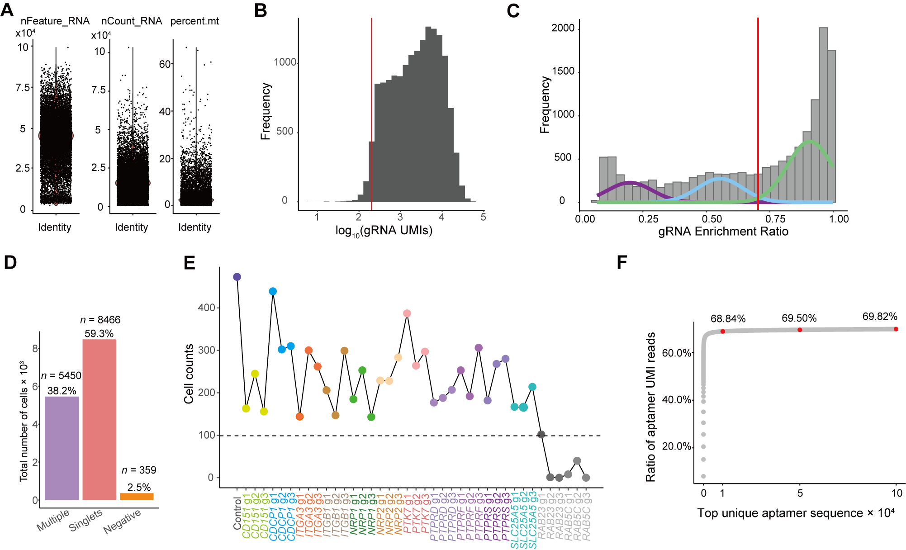
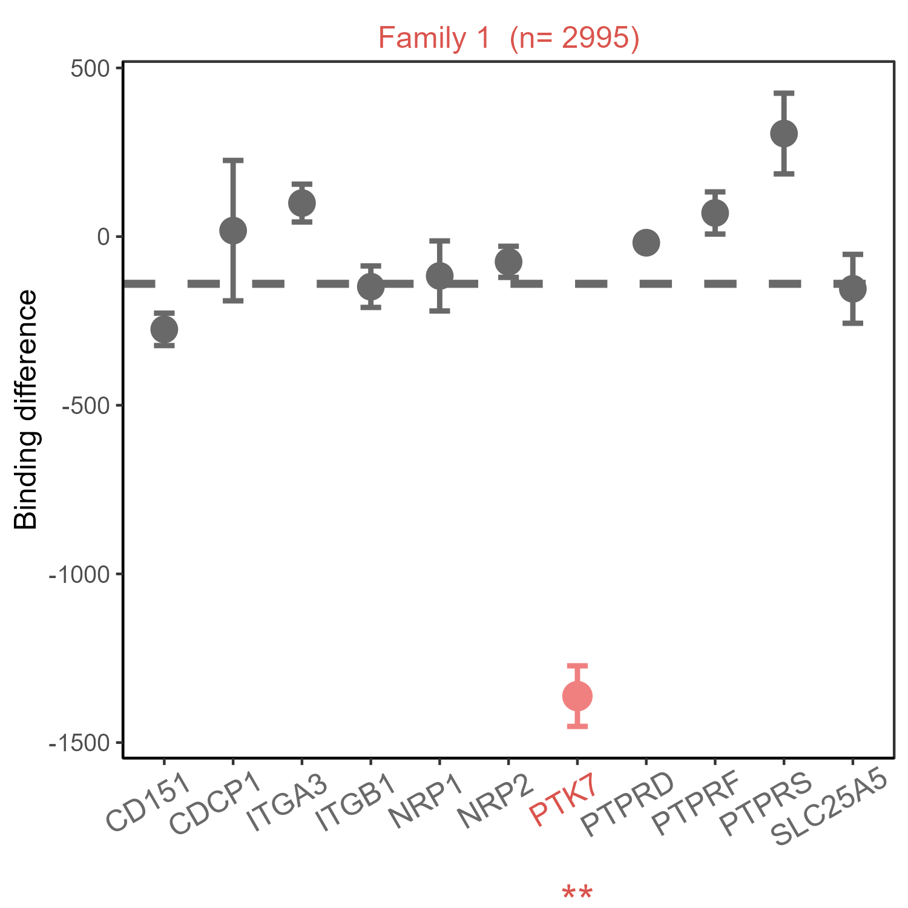

# SPARTA
This package offers tools for SPARK-seq data analysis. It includes three main steps: 1) quality control and cell classification, 2) aptamer-target interaction prediction, and 3) data visualization.

Additionally, SPARTA includes two deep learning modules: one for aptamer binding potential prediction and another for de novo aptamer generation.
 


## Installation
First, install the necessary dependencies for aptamer family clustering, which are MCL (https://micans.org/mcl/) and BLAST (https://blast.ncbi.nlm.nih.gov/).

```
conda install bioconda::mcl
conda install biopython
```

You can install this R package using the following method:
Use the `devtools` package to install the latest version directly from GitHub:

```
#install.packages("devtools")
devtools::install_github("fuyboo/SPARTA")
```

## Input data preparation


### Raw data preparation
The data analysis from raw data to the generation of mRNA, aptamer, and sgRNA expression matrices was performed using CellRanger (from 10x Genomics). For details, please refer to the document https://github.com/fuyboo/SPARTA/blob/main/raw_process/raw_process.pdf.

### Aptamer Family Classification
Based on the results of the previous aptamer preprocessing step, select aptamers with a certain level of enrichment for family analysis. For example, the top 10,000 most enriched sequences can be selected for subsequent family analysis.
Then, classify aptamer sequences based on their similarities using the BLAST-vs-BLAST and MCL strategy.
with parameters: -t threads -i inflation value for mcl algorithm  -e pvalue_threshold -o output_directory

```
python ./aptamer_family_analysis/smart_cluster.py  -t 35 -i 0.7 -e 0.05 -o ./data/output

```
The resulted family information of the aptamers are saved in a file such as ./data/output/Aptamer_family.csv.


| name  | seq | group | 
| ------------- | ------------- | ------------- |
| Apt-1  | TTTCGGCGGGTGAATATCCAACTGGTCCGTCCCTTGGGATCTTTGT  | Family-1  |
| Apt-2  | GGTTTGCTGAGGTGGGCGTCGTTGAATGTTAGTTCGGGAATACTTG  | Family-2  |
| Apt-3  | GGCTCCTCTTAGGGGCTGTGACCGGCGGGCGGGAATGTAGCAGGAT  | Family-3  |


## The formal analysis：Aptamer-target interaction prediction 
Based on the previous aptamer sequence family grouping information, the aptamer family abundance matrix was generated from the UMI count matrix of the aptamer sequences.For example,we generated 'motit_need_1w' matrix.

```
library('Seurat')
library('aptpro')
library('mixtools')
library('ggplot2')
library('dplyr')


aptamer_family<-read.csv("./data/output/Aptamer_family.csv",row.names=1)
top_aptamer_sequence<-aptamer_family$seq

#Read the results of **Raw data preparation**.
mrna_sgrna<-Read10X("./SPARK_result/filtered_feature_bc_matrix/")
aptamer<-Read10X("./SPARK_result/Aptamer_result/")


#mRNA abundance matrix
SUM159 <- CreateSeuratObject(counts = raw_mrna_sgrna$`Gene Expression`[rowSums(raw_mrna_sgrna$`Gene Expression`)>0,])
#sgRNA abundance matrix
SUM159[["sgRNA"]] <- CreateAssayObject(raw_mrna_sgrna$`CRISPR Guide Capture`)
#top_aptamer abundance matrix
SUM159[["aptamer"]] <- CreateAssayObject(aptamer[top_aptamer_sequence,])
#aptamer family abundance matrix
aptamer_need_1w<-GetAssayData(SUM159, slot = "counts",assays="apatmer")
aptamer_need_1w<- data.frame(aptamer_need_1w)
aptamer_need_1w$group <- aptamer_family$group
motif_need_1w <- aptamer_need_1w %>%
  group_by(group) %>%
  summarise_all(sum)
motif_need_1w[1:3,1:3]

```
|               |AAACCTGAGAGGTTGC-1 |AAACCTGAGATCCCGC-1 |AAACCTGAGATGTAAC-1 |
| ------------- | ------------- | ------------- | ------------- |
|Family-1            |1318               |1572               |3172               |
|Family-2            |713                |736                |260                |
|Family-3            |629                |620                |264                |
```
SUM159[["motif1w"]]<-CreateAssayObject(motif_need_1w)
```

### Step1: Quality control and cell classification
  Before performing cell quality control, ensure that you have a Seurat object that includes three essential components: mRNA, aptamer and motif.

```
SUM159<-cell_quality (SUM159,
                      count_threshold = 100,
                      feature_threshold = 200,
                      percent_mt_threshold = 10,
                      assay = "sgRNA",
                      save_path = NULL)
```
<div align="center">
  
</div>


  In this step, you will assign a gRNA identity to each cell and calculate enrichment ratios, defined as the proportion of counts from the most abundant gRNA relative to the total gRNA counts in the cell, using cell gRNA counts assessed in Step 1. This process involves setting thresholds to categorize cell gRNA effectively.
```
SUM159<-cell_gRNA_identity(SUM159,
                           assay='sgRNA',
                           min_count = 200,
                           min_ratio = 0.7)
```

### Step2: Aptamer-target interaction prediction
  In this step, you will predict which proteins are likely bound by the aptamer families. This involves calculating the differential matrix based on the median difference between target cells and NC (Control) cells, filtering out low-difference families and confusing targets（If more than half of the families are ranked in the top three, then we believe that they are gRNAs that easily cause confusing differences.）, and using a Gaussian Mixture Model (GMM) to refine the predictions.

```
predict_result<-predict_apt_pro(SUM159,
                                assay = "motif1w",
                                top_n = 20,
                                save_path = NULL)
```

### Step3: Data visualization
  Visualization is crucial for interpreting and presenting the results of your aptamer-protein binding predictions. In this step, you'll generate plots to help understand the data and findings from the previous analysis.

```
visualize_aptamer_difference(predict_result,'Clust-1')

```
<div align="center">
  
</div>

### Step4: Aptamer target validation
  To further validate aptamer–target interaction specificity identified by SPARTA, this step examines copy number differences of individual aptamers within each aptamer family between control and target-knockout cells. For each protein target, volcano plots are generated to visualize log2 fold changes in aptamer abundance and corresponding significance levels. These plots reveal variable shifts in binding after target knockout, indicating that individual aptamers display distinct sensitivities to target expression levels.

```
plot_aptamer_volcano(
    seurat_obj = SUM159,
    proteins   = "PTK7")
```
<div align="center">

</div>

## deep learning modules
### Aptamers binding potential prediction
   Through the previous classification of the aptamer family, aptamer sequences binding to the PTK7 protein were identified. Based on these sequences, we trained the FCNARRB model（[https://github.com/turningpoint1988/fcnarbb](https://github.com/turningpoint1988/fcnarbb)）, enabling accurate prediction of whether unknown sequences can bind to the PTK7 protein.

```

python ./aptamer_family_analysis/fcna_trainer.py -train_data ./data/input/ptk7_2cls_new.csv -external_data ./data/input/external_data.csv -output_path ./data/output/aptamer_prediction

```

### De novo aptamer generation
Based on the results of Aptamer Family Classification, aptamer sequences binding and non-binding to PTK7 protein were used to train the RaptGen model ([https://github.com/hmdlab/raptgen](https://github.com/hmdlab/raptgen)) to generate new sequences with potential PTK7 protein binding affinity.

```

python ./aptamer_family_analysis/raptgen_aptamer.py -ptk7_sample_path ./data/input/clust1_ptk7.csv -negatibe_sample_path ./data/input/other_sequences.csv 

```


