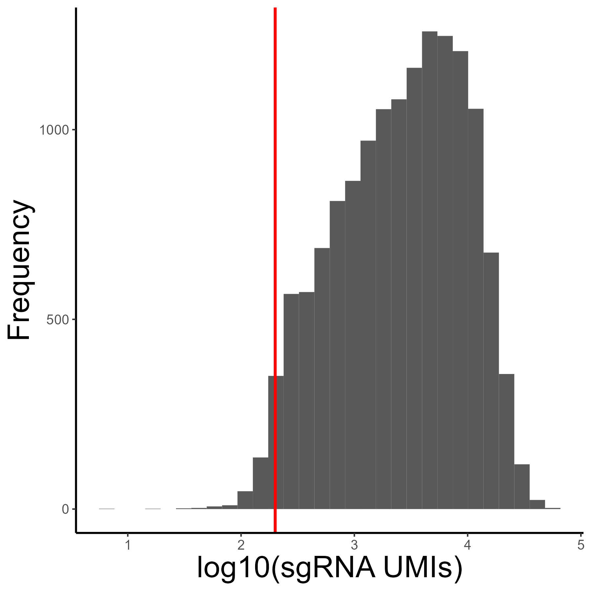
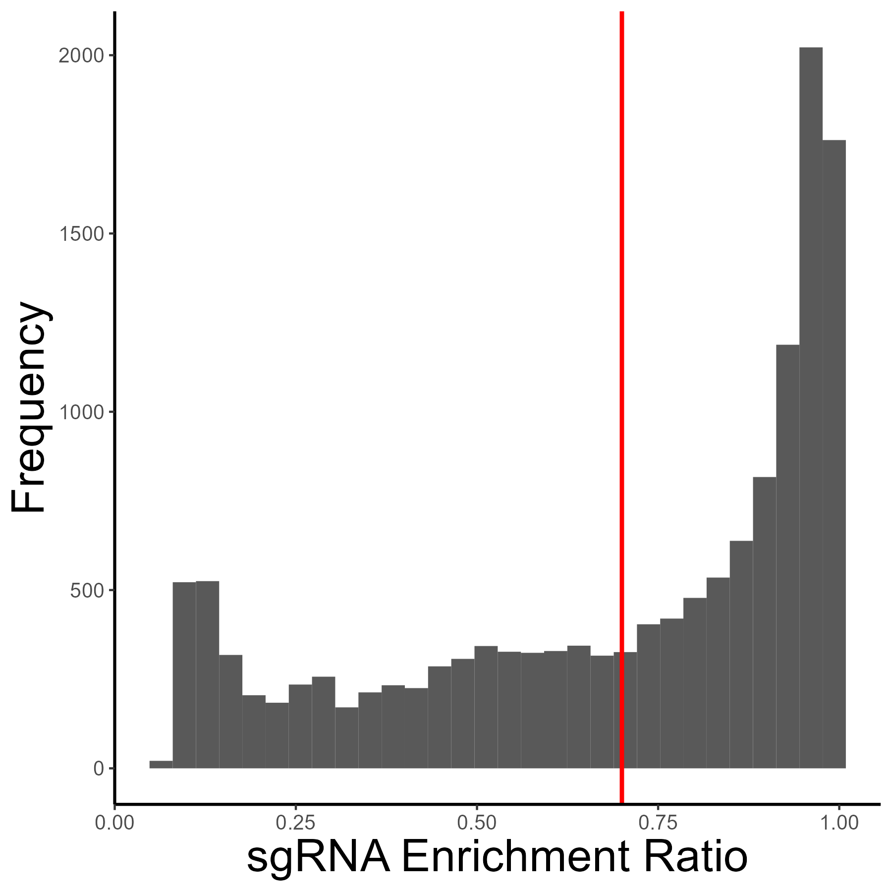

# SPARTA
This package offers tools for SPARK-seq data analysis. It includes three main steps: 1) quality control and cell classification, 2) aptamer-target interaction prediction, and 3) data visualization.

Additionally, SPARTA includes two deep learning modules: one for aptamer binding potential prediction and another for de novo aptamer generation.
 


## Installation
First, install the necessary dependencies for aptamer family clustering, which are MCL (https://micans.org/mcl/) and BLAST (https://blast.ncbi.nlm.nih.gov/).

```
conda install bioconda::mcl
conda install biopython
```

You can install this R package using the following method:
Use the `devtools` package to install the latest version directly from GitHub:

```
#install.packages("devtools")
devtools::install_github("fuyboo/aptpro")
```

## Input data preparation

### raw data preparation
原始数据到生成mRNA、aptamers、sgRNA表达矩阵的过程可以参考 raw_process.pdf

cellrange*******
#####
### Aptamer Family Classification
Classify aptamer sequences based on their similarities using the BLAST-vs-BLAST and MCL strategy.
-t threads -i *** -e pvalue_threshold o output_directory

```
python ./code/smart_cluster.py  -t 35 -i 0.7 -e 0.05 -o ./lgy/data_3/motif/test1w

```
****步骤呢？？？


## Example

### Step1: quality control and cell classification
  Before performing cell quality control, ensure that you have a Seurat object that includes three essential components: mRNA, aptamer and motif.

```
SUM159=read
SUM159<-cell_quality (SUM159,
                      count_threshold = 100,
                      feature_threshold = 200,
                      percent_mt_threshold = 10,
                      assay = "sgRNA",
                      save_path = NULL)
```

<div align="center">
  
  
</div>


  In this step, you will assign a gRNA identity to each cell and calculate enrichment ratios using cell gRNA counts, which were assessed in Step 1. This process involves setting thresholds to categorize cell gRNA effectively.

```
SUM159<-cell_gRNA_identity(SUM159,
                           assay='sgRNA',
                           min_count = 200,
                           min_ratio = 0.7)
```

### Step3: Predict Aptamer Family Protein Binding
  In this step, you will predict which proteins are likely bound by the aptamer families. This involves calculating the differential matrix based on the median difference between target cells and NC (Control) cells, filtering out low-difference families and confusing targets（If more than half of the families are ranked in the top three, then we believe that they are gRNAs that easily cause confusing differences.）, and using a Gaussian Mixture Model (GMM) to refine the predictions.

```
predict_result<-predict_apt_pro(SUM159,
                                assay = "motif1w",
                                top_n = 20,
                                save_path = NULL)
```

### Step4: Visualize Prediction Results
  Visualization is crucial for interpreting and presenting the results of your aptamer-protein binding predictions. In this step, you'll generate plots to help understand the data and findings from the previous analysis.

```
visualize_aptamer_difference(predict_result,'Clust-1')

```
<div align="center">
  
</div>


